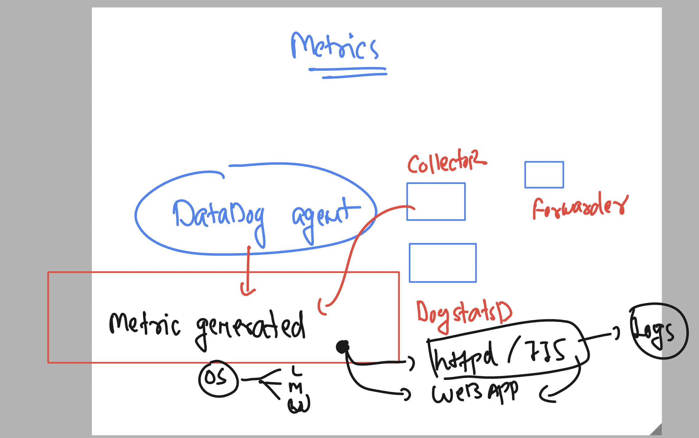
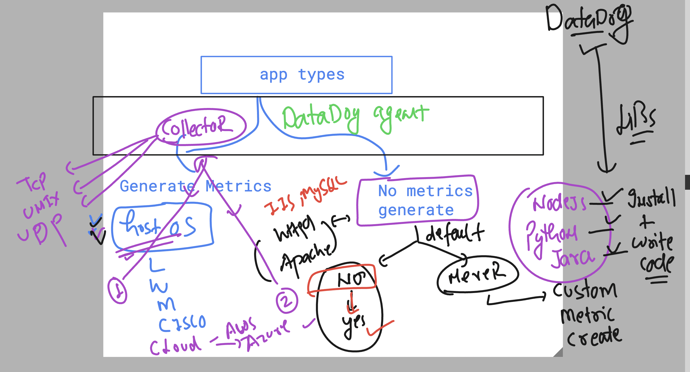
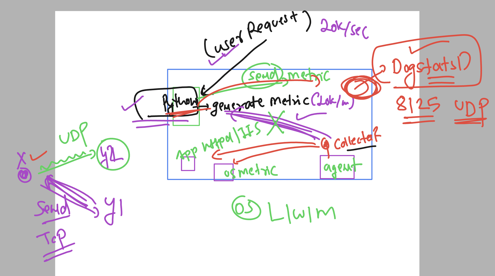
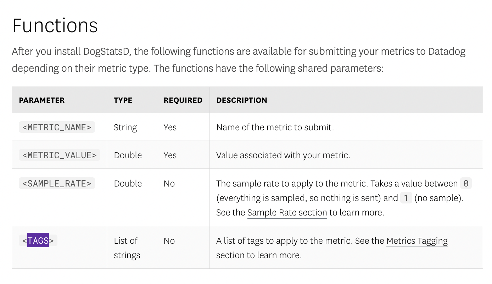
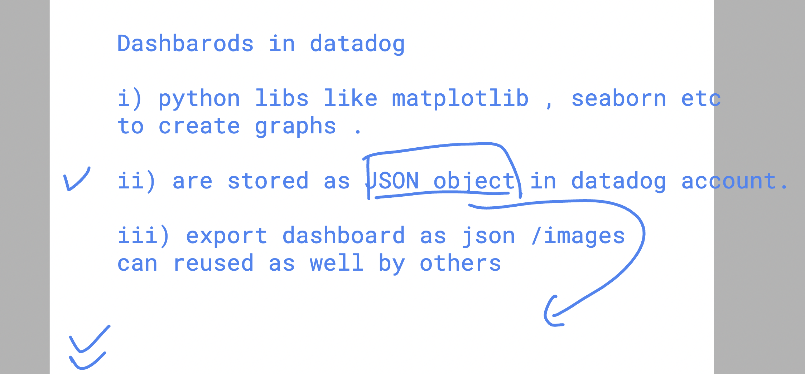

### Understanding mindset of Metrics Generation and collection 



### custom metrics required in many cases to start monitoring apps 



### Welcome to DogstatsD in datadog 



### checking datadog agent status

```
 systemctl status datadog-agent
● datadog-agent.service - Datadog Agent
     Loaded: loaded (/usr/lib/systemd/system/datadog-agent.service; enabled; preset: disabled)
     Active: active (running) since Thu 2024-10-24 07:57:38 UTC; 56s ago
   Main PID: 2084 (agent)
      Tasks: 8 (limit: 4658)
```
### dogstatsD is running on 8125 in UDP mode 

```
netstat -nulp
Active Internet connections (only servers)
Proto Recv-Q Send-Q Local Address           Foreign Address         State       PID/Program name    
udp        0      0 127.0.0.1:8125          0.0.0.0:*                           2084/agent          
udp        0      0 172.31.92.124:68        0.0.0.0:*                           2053/systemd-networ 
udp        0      0 127.0.0.1:323           0.0.0.0:*                           2273/chronyd        
udp6       0      0 ::1:323                 :::*                                2273/chronyd        
udp6       0      0 fe80::10fc:6eff:fed:546 :::*                                2053/systemd-networ 
[root@ip-172-31-92-124 ~]# 

```

### creating a python webapp 

```
mkdir /opt/pyappnew
[root@ip-172-31-92-124 ~]# 
[root@ip-172-31-92-124 ~]# cd /opt/pyappnew/
[root@ip-172-31-92-124 pyappnew]# 

===> creating app
nano ashu.py 
```

### to generate Custom metrics by datadog -- checklist 



[clickHERE_forMoreInfo](https://docs.datadoghq.com/metrics/custom_metrics/dogstatsd_metrics_submission/)

### Installing datadog Libs to generate custom metrics by python code

```
pip install --upgrade datadog 
Collecting datadog
  Downloading datadog-0.50.1-py2.py3-none-any.whl (119 kB)
     |████████████████████████████████| 119 kB 7.0 MB/s            
Requirement already satisfied: requests>=2.6.0 in /usr/lib/python3.9/site-packages (from datadog) (2.25.1)
Requirement already satisfied: chardet<5,>=3.0.2 in /usr/lib/python3.9/site-packages (from requests>=2.6.0->datadog) (4.0.0)
Requirement already satisfied: urllib3<1.27,>=1.21.1 in /usr/lib/python3.9/site-packages (from requests>=2.6.0->datadog) (1.25.10)
Requirement already satisfied: idna<3,>=2.5 in /usr/lib/python3.9/site-packages (from requests>=2.6.0->datadog) (2.10)
Installing collected packages: datadog
Successfully installed datadog-0.50.1
WARNING: Running pip as the 'root' user can result in broken permissions and conflicting behaviour with the system package manager. It is recommended to use a virtual environment instead: https://pip.pypa.io/warnings/venv
[root@ip-172-31-92-124 pyappnew]# 

```

## lets change code to generate metrics as well

```
[oot@ip-172-31-92-124 pyappnew]# ls
ashu.py
[root@ip-172-31-92-124 pyappnew]# >ashu.py 
[root@ip-172-31-92-124 pyappnew]# nano ashu.py 
[root@ip-172-31-92-124 pyappnew]# 

```

### Dashobards in one Go 



