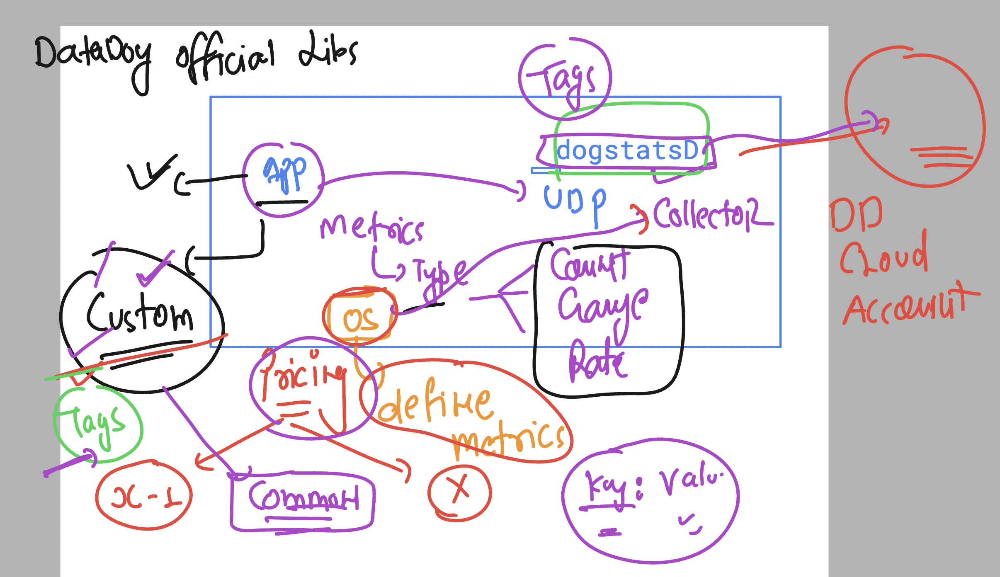

## Revision of DogstatsD and custom metrics consideration 



## Understanding API in datadog 


## to connect with datadog we need the correct API URL 


### curl tool to get dashbaord list 

```
curl -X GET "https://api.us5.datadoghq.com/api/v1/dashboard" \
-H "Content-Type: application/json" \
-H "DD-API-KEY: " \
-H "DD-APPLICATION-KEY: "


```

### creating dashboard using curl 

```
curl -X POST "https://api.us5.datadoghq.com/api/v1/dashboard" \
-H "Content-Type: application/json" \
-H "DD-API-KEY: <YOUR_API_KEY>" \
-H "DD-APPLICATION-KEY: <YOUR_APP_KEY>" \
-d '{
    "title": "ashutoshh automation",
    "widgets": [
        {
            "definition": {
                "type": "timeseries",
                "requests": [
                    {
                        "q": "avg:system.cpu.user{*}",
                        "display_type": "line",
                        "style": {
                            "palette": "dog_classic",
                            "line_type": "solid",
                            "line_width": "normal"
                        }
                    }
                ],
                "title": "CPU Usage (User)"
            }
        },
        {
            "definition": {
                "type": "timeseries",
                "requests": [
                    {
                        "q": "avg:system.mem.used{*}",
                        "display_type": "line",
                        "style": {
                            "palette": "cool",
                            "line_type": "solid",
                            "line_width": "normal"
                        }
                    }
                ],
                "title": "Memory Usage"
            }
        }
    ],
    "layout_type": "ordered",
    "is_read_only": false,
    "notify_list": []
}'

```
