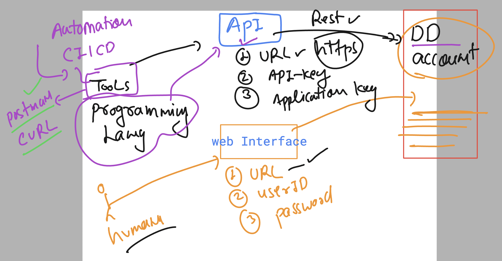

## Revision of DogstatsD and custom metrics consideration 


## Understanding API in datadog 



## to connect with datadog we need the correct API URL 


### curl tool to get dashbaord list 

```
curl -X GET "https://api.us5.datadoghq.com/api/v1/dashboard" \
-H "Content-Type: application/json" \
-H "DD-API-KEY: " \
-H "DD-APPLICATION-KEY: "


```

### creating dashboard using curl 

```
curl -X POST "https://api.us5.datadoghq.com/api/v1/dashboard" \
-H "Content-Type: application/json" \
-H "DD-API-KEY: <YOUR_API_KEY>" \
-H "DD-APPLICATION-KEY: <YOUR_APP_KEY>" \
-d '{
    "title": "ashutoshh automation",
    "widgets": [
        {
            "definition": {
                "type": "timeseries",
                "requests": [
                    {
                        "q": "avg:system.cpu.user{*}",
                        "display_type": "line",
                        "style": {
                            "palette": "dog_classic",
                            "line_type": "solid",
                            "line_width": "normal"
                        }
                    }
                ],
                "title": "CPU Usage (User)"
            }
        },
        {
            "definition": {
                "type": "timeseries",
                "requests": [
                    {
                        "q": "avg:system.mem.used{*}",
                        "display_type": "line",
                        "style": {
                            "palette": "cool",
                            "line_type": "solid",
                            "line_width": "normal"
                        }
                    }
                ],
                "title": "Memory Usage"
            }
        }
    ],
    "layout_type": "ordered",
    "is_read_only": false,
    "notify_list": []
}'

```

### planning alerts for log based trigger 


### database monitoring with datadog 


## setup and configure 

```
yum install mariadb105-server   -y

===> starting service 
[root@ip-172-31-92-124 ~]# systemctl start mariadb
[root@ip-172-31-92-124 ~]# systemctl status mariadb
● mariadb.service - MariaDB 10.5 database server
     Loaded: loaded (/usr/lib/systemd/system/mariadb.service; disabled; preset: disabled)
     Active: active (running) since Fri 2024-10-25 10:32:47 UTC; 7s ago
       Docs: man:mariadbd(8)

===> setting credentails 
mysql_secure_installation 

mysql_secure_installation 

NOTE: RUNNING ALL PARTS OF THIS SCRIPT IS RECOMMENDED FOR ALL MariaDB
      SERVERS IN PRODUCTION USE!  PLEASE READ EACH STEP CAREFULLY!

In order to log into MariaDB to secure it, we'll need the current
password for the root user. If you've just installed MariaDB, and
haven't set the root password yet, you should just press enter here.

Enter current password for root (enter for none): 
OK, successfully used password, moving on...

Setting the root password or using the unix_socket ensures that nobody
can log into the MariaDB root user without the proper authorisation.

You already have your root account protected, so you can safely answer 'n'.

Switch to unix_socket authentication [Y/n] y
Enabled successfully!
Reloading privilege tables..
 ... Success!

```
### verify by login 

```
[root@ip-172-31-92-124 ~]# mysql -u root -p'Redhat'
Welcome to the MariaDB monitor.  Commands end with ; or \g.
Your MariaDB connection id is 14
Server version: 10.5.25-MariaDB MariaDB Server

Copyright (c) 2000, 2018, Oracle, MariaDB Corporation Ab and others.

Type 'help;' or '\h' for help. Type '\c' to clear the current input statement.

MariaDB [(none)]> ^DBye
[root@ip-172-31-92-124 ~]# mysql -u root -p
Enter password: 
Welcome to the MariaDB monitor.  Commands end with ; or \g.
Your MariaDB connection id is 15
Server version: 10.5.25-MariaDB MariaDB Server

Copyright (c) 2000, 2018, Oracle, MariaDB Corporation Ab and others.

Type 'help;' or '\h' for help. Type '\c' to clear the current input statement.

```

### creating user for datadog access 

```
CREATE USER 'datadog'@'localhost' IDENTIFIED BY 'datadog_password';
GRANT REPLICATION CLIENT, PROCESS  ON *.* TO 'datadog'@'localhost';
flush privileges;
exit;

```

### verify 

```
[root@ip-172-31-92-124 ~]# mysql -u datadog  -p'datadog_password'
Welcome to the MariaDB monitor.  Commands end with ; or \g.
Your MariaDB connection id is 18
Server version: 10.5.25-MariaDB MariaDB Server

Copyright (c) 2000, 2018, Oracle, MariaDB Corporation Ab and others.

Type 'help;' or '\h' for help. Type '\c' to clear the current input statement.

MariaDB [(none)]> show databases;
+--------------------+
| Database           |
+--------------------+
| information_schema |
+--------------------+
1 row in set (0.000 sec)

MariaDB [(none)]> exit;
Bye

```

### 

```
mysql -u datadog  -p'datadog_password'    -e "show status" 
+--------------------------------------------------------+--------------------------------------------------+
| Variable_name                                          | Value                                            |
+--------------------------------------------------------+--------------------------------------------------+
| Aborted_clients                                        | 0                                                |
| Aborted_connects                                       | 0                                                |
| Aborted_connects_preauth                               | 0                                                |
| Access_denied_errors                                   |

```

### datadog integration 

```
 cd /etc/datadog-agent/conf.d/mysql.d/
[root@ip-172-31-92-124 mysql.d]# ls
conf.yaml.example
[root@ip-172-31-92-124 mysql.d]# nano  ashudb.yaml  


init_config:

instances:
  - host: 127.0.0.1
    username: datadog
    password: "datadog_password"
    port: 3306
    options:
      replication: false
      galera_cluster: true
      extra_status_metrics: true
      extra_innodb_metrics: true
      schema_size_metrics: false
      disable_innodb_metrics: false
```

### data config check and restart 

```
349  datadog-agent configcheck
  350  systemctl restart datadog-agent

```